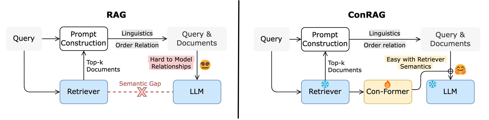

# Enabling Seamless Connection Across Semantic Gap between Retrievers and LLMs



The official Github repository for paper ConRAG.

## Abstract

Retrieval-augmented generation (RAG) has attracted significant attention for enhancing large language models (LLMs) in domain-specific and knowledge-intensive tasks by utilizing external documents retrieved by retrievers. However, LLMs often struggle to determine which retrieved documents are relevant and how they relate to one another. We argue that this difficulty arises from a semantic gap between retrievers and LLMs due to differences in their training objectives and architectures. Existing methods either align retrievers and LLMs through costly fine-tuning or feedback signals, but they still do not explicitly strengthen document relationship modeling during generation. This paper proposes ConRAG, a novel enhanced RAG framework to establish an information connection between retrievers and LLMs in RAG, thereby enhancing relationship modeling of LLMs. Specifically, ConRAG employs a lightweight Con-Former model, placed between a retriever and an LLM to capture and transmit semantic information. Then, a semantics injection strategy is employed to integrate the semantic information into the LLM's generation. Accordingly, we employ three tasks for feature modeling and alignment: two relationship modeling tasks to consolidate the local and global perceptions of document relevance and one generative alignment task to facilitate the interpretation of LLM. Notably, ConRAG is suitable for low-resource scenarios where LLMs and retrievers are frozen. Further analysis shows that retriever-derived information helps the LLM better identify relevant evidence and model relationships among documents, leading to more effective generation. The source code is available at [https://github.com/yefd/ConRAG](https://github.com/yefd/ConRAG).

## Quick Start
This guide will walk you through processing datasets and training.

### Prepare the code and environment
Git clone our repository and install following packages.
```
torch==2.1.2
transformers==4.40.2
sentence-transformers==2.6.1
trl==0.8.1
peft==0.10.0
```

### Dataset Preparation
For NQ datasets, download from the repository of [lost-in-the-middle](https://github.com/nelson-liu/lost-in-the-middle/tree/main/qa_data). Other datasets refer their official websites.

### (Optional) Fine-tune a Retriever
To directly improve RAG performance, you can fine-tune a retriever using [retrieval/finetune_retriever.py](retrieval/finetune_retriever.py). This step is optional but recommended for achieving optimal results. Here we fine-tune a BERT using SentenceTransformer.
```bash
cd retrieval
python finetune_retriever.py \
    --dataset_name nq_10 \
    --input_path 10_total_documents/nq-open-10_total_documents_gold_at_0.jsonl.gz \
    --model_name google-bert/bert-base-uncased \
    --train_batch_size 32 \
    --num_epoch 4
```
where
- `dataset_name`: The name of dataset to be used.
- `input_path`: The file path of dataset.
- `model_name`: The retriever model name or path to be fine-tuned.
The finetuned retriever model will be saved in the `retrieval/retrievers` folder. For HotpotQA, MuSiQue, 2Wiki datasets, please use `train_data_path` and `test_data_path`. Detailed commands are available in [scripts/retriever](scripts/retriever) folder.

### Rank and extract features with a retriever
Before training, it is need to extract retrieval features from the retriever. You have the flexibility to select the fine-tuned or non-trained retrieval model, such as `google-bert/bert-base-uncased`, `BAAI/bge-reranker-large`, `facebook/contriever`.

For details, refer to the [retrieval/retrieval_extration.ipynb](retrieval/retrieval_extration.ipynb) folder for specific commands.

Besides, you can get retrieval features from OpenAI Embedding using [retrieval/feature_extraction_openai.py](retrieval/feature_extraction_openai.py). Ensure you configure the `api_key` in the script at Line 39 before execution.
```bash
cd retrieval
python feature_extraction_openai.py \
    --dataset_name nq_10 \
    --input_path 10_total_documents/nq-open-10_total_documents_gold_at_0.jsonl.gz \
    --model_name text-embedding-3-large \
    --emb_save_path dataset/nq_10_openai_embedding_large.pkl \
    --dataset_save_path dataset/nq-open-10_total_documents_gold_openai_large.pkl
```
where
- `emb_save_path`: The .pkl file path to save embeddings.
- `dataset_save_path`: The .pkl file path to save dataset.

### Train ConRAG
[runner.py](runner.py) is the central script for training, generation and evaluation. You can train Con-Former by:
```bash
python runner.py \
    --dataset_name nq_10 \
    --input_path dataset/nq/nq-open-10_total_documents_gold_bert_emb.pkl \
    --standard_prompt \
    --model_name models/Mistral-7B-Instruct-v0.3 \
    --max_prompt_length 4096 \
    --output_dir output/conrag_7b_nq10 \
    --use_training \
    --freeze_llm \
    --completion_only \
    --num_k 10 \
    --input_dim 768 \
    --model_type conrag \
    --use_evaluation \
    --save_results \
    --save_model \
    --num_train_epochs 2 \
    --per_device_train_batch_size 1 \
    --instruction_type chat
```
where
- `input_path`: The file path to the pre-processed dataset, typically a .pkl file containing retrieval features.
- `model_name`: The name or path of the LLM used for training. This can be a model from Hugging Face's model hub or a local path to a model file.
- `use_training`: Enables the training mode in the script.
- `save_model`: If set, the trained model will be saved to `output_dir`. 
- `output_dir`: The directory to save model. 
- `freeze_llm`: If set, this freezes the parameters of the LLM during training.
- `num_k`: Specifies the number of top documents. 
- `use_evaluation`: Enables the evaluation mode.
- `save_results`: If set, results from generation will be saved to `output` folder.

Or, training Con-Former and LLM.

You can customize selecting different Large Language Models (LLMs), datasets, and various other parameters. For example, you can get the standard RAG results by:
```bash
python runner.py \
    --dataset_name nq_10 \
    --input_path dataset/nq/nq-open-10_total_documents_gold_bert.pkl \
    --model_name models/Mistral-7B-Instruct-v0.3 \
    --max_prompt_length 4096 \
    --freeze_llm \
    --num_k 10 \
    --model_type rag \
    --use_evaluation \
    --save_results \
    --instruction_type chat
```
For HotpotQA, 2Wiki, and MuSiQue datasets, refer to the [scripts/conrag](scripts/conrag) folder for specific commands to train ConRAG.

For the baselines in our experiments, refer to the [scripts/baselines](scripts/baselines) folder for specific commands to train ConRAG.

